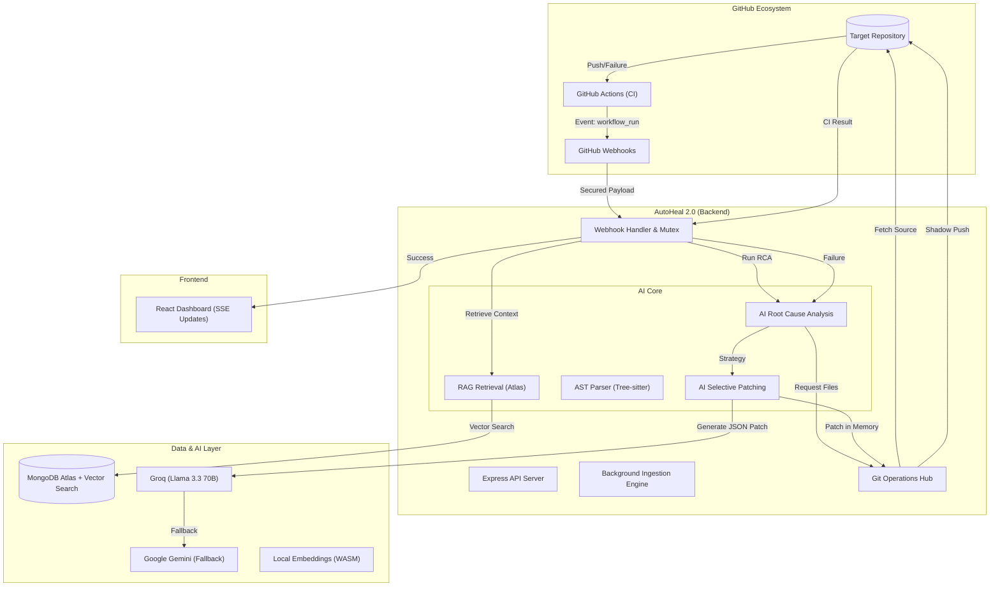

# 🩹 AutoHeal 2.0 — AI-Powered Self-Healing CI/CD Platform

AutoHeal 2.0 is a full-stack SaaS platform that **automatically detects CI/CD failures**, **diagnoses root causes using AI**, and **generates pull requests with fixes** — all without human intervention.


## 🖼️ Product Showcase

<p align="center">
  
  <br>
  <b>The Command Center</b>: A high-fidelity, interactive hub for autonomous CI.
</p>

<p align="center">
  
  
  <br>
  <b>Seamless Control</b>: Manage repository connections and monitor live healing pipelines in real-time via Server-Sent Events (SSE).
</p>

---

## 🏗️ Architecture & Logic Flow

AutoHeal 2.0 operates on a weightless, event-driven architecture designed for extreme scalability and cost-efficiency.



### 1. 👻 Shadow Branching (The Zero-Infra Testing)
Instead of running heavy CI tests locally, AutoHeal offloads **100% of the testing compute infrastructure to GitHub**.
- After generating a fix, the backend pushes code to a hidden, temporary branch (`fix/autoheal-...`).
- GitHub Actions runs the user's native CI suite on this branch.
- AutoHeal intercepts the result via webhooks. If it passes, only then is a PR opened. This ensures developers *never* see a failing AI PR.

### 2. 🧠 Local RAG & AST Chunking
To scale to massive codebases without hitting AI token limits, AutoHeal utilizes **Retrieval-Augmented Generation**:
- **Background Ingestion:** When a repo is enabled, a non-blocking worker clones it, parses it via `web-tree-sitter` (AST), and extracts individual functions.
- **Local Embeddings:** Code chunks are converted into vectors locally using **Xenova Transformers (all-MiniLM-L6-v2)** running in WASM—zero API cost.
- **Vector Search:** During a crash, AutoHeal performs a `$vectorSearch` in MongoDB Atlas to surgically find the exact function responsible for the error.

### 3. ♻️ Smart Retry Loops
If an AI-generated fix fails validation on the Shadow Branch, the system doesn't give up. It extracts the *new* error logs, feeds the previous attempt back into the AI as a "failed lesson," and triggers a recursive healing cycle until the code passes all tests.

---

## ✨ Key Features

- **🔐 Enterprise Security** — GitHub tokens encrypted with AES-256-GCM; HMAC-signed webhooks.
- **🤖 Multi-Model Fallback** — Primary RCA on Groq (Llama 3.3 70B) with instant cascade to Google Gemini 2.0 Flash if rate limits are hit.
- **⚡ Real-Time SSE** — Live pipeline status updates pushed to the frontend via Server-Sent Events—no polling needed.
- **🛠️ JSON Selective Patching** — AI outputs search/replace blocks instead of full files, slashing token consumption by 90% and preventing indentation errors.
- **🚫 Infinite Loop Protection** — Built-in circuit breakers limit executions per repository to prevent runaway CI costs.

---

## 📋 Tech Stack

| Layer | Technology |
|-------|-----------|
| **Frontend** | React 19, Vite 6, Framer Motion, Tailwind CSS, Lucide React |
| **Backend** | Node.js, Express, Passport.js (GitHub OAuth), JWT |
| **Database** | MongoDB Atlas (Vector Search + Aggregation Pipelines) |
| **AI (RCA/Fix)** | Groq (Llama-3.3-70b-versatile), Google Gemini 2.0 Flash |
| **AI (Embeddings)** | Xenova Transformers (WASM), `all-MiniLM-L6-v2` |
| **Parsing** | `web-tree-sitter` (Abstract Syntax Tree analysis) |
| **Real-time** | Server-Sent Events (SSE) |

---

## 🛠️ Setup

### Prerequisites

- Node.js 18+
- MongoDB Atlas account (with a Vector Search Index named `vector_index`)
- GitHub OAuth App
- Groq API key & Gemini API key
- ngrok (for local webhook delivery)

### 1. Installation

```bash
git clone https://github.com/CodeByAfroj/AutoHeal.git
cd AutoHeal

# Install Backend
cd backend && npm install

# Install Frontend
cd ../frontend && npm install
```

### 2. Environment Configuration

Create `backend/.env`:

```env
GITHUB_CLIENT_ID=your_id
GITHUB_CLIENT_SECRET=your_secret
MONGODB_URI=your_atlas_uri
JWT_SECRET=your_secret
ENCRYPTION_KEY=64_hex_chars
GROQ_API_KEY=gsk_...
GEMINI_API_KEY=AIza...
NGROK_URL=https://...
WEBHOOK_SECRET=your_secret
FRONTEND_URL=http://localhost:5173
PORT=8000
```

### 3. Vector Index Setup
In MongoDB Atlas, create a Search Index on the `codechunks` collection:
```json
{
  "fields": [
    {
      "numDimensions": 384,
      "path": "embedding",
      "similarity": "cosine",
      "type": "vector"
    }
  ]
}
```

---

## 📁 Project Structure

```
AutoHeal/
├── backend/
│   ├── routes/
│   │   ├── webhook.js         # Core Event Logic & Shadow Branching
│   │   ├── repos.js           # Repo Mgmt & Auto-Webhook Creation
│   │   └── executions.js      # SSE status streaming
│   ├── utils/
│   │   ├── ai-fixer.js        # RCA & Selective Patching logic
│   │   ├── rag.js             # Local Embedding & Vector Search
│   │   ├── ingestor.js        # Background Ingestion Worker
│   │   ├── ast.js             # Tree-sitter Code Chunking
│   │   └── events.js          # Server-Sent Events (SSE) manager
│   └── server.js              # Entry Point
├── frontend/
│   └── src/
│       ├── pages/             # Dashboard, Pipelines (Real-time monitoring)
│       └── components/        # High-Fidelity UI components
└── README.md
```

---

made with ❤️ by Team CodeImpact

